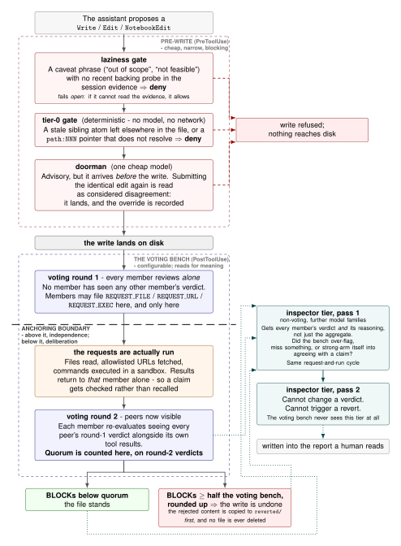
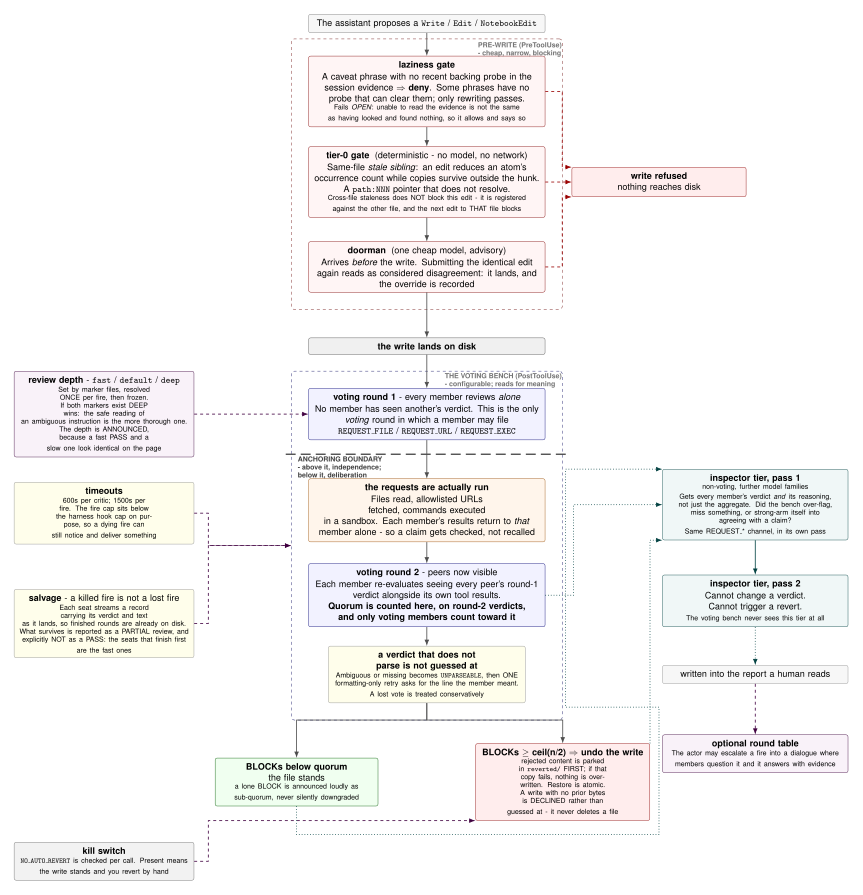

# agentic-council

agentic-council is a multi-model adversarial-review engine. Critics from different
model families hold an actor's claims to an explicit quality bar, and -- during a
review -- can read files, fetch allowlisted URLs, and run sandboxed commands to
check those claims against ground truth instead of reasoning from memory.

It ships as a **Claude Code integration** (a council on every `Write` / `Edit` /
`NotebookEdit` that refuses lazy "out of scope" / "GPU required" / "not feasible"
caveats unless a backing probe actually ran), but the engine has generalized past
that: a review is invokable as a plain subprocess, not only a hook, and the actor
it reviews -- the tool-using **leader** -- is now a selectable role, not only
Claude. A model named in the roster's `leader` field takes the turns, and every
file it writes is reviewed by the council *before* it touches disk.

The review runs in **two tiers**: six voting critics plus a six-model non-voting
inspector tier from further model families. It does not trust the actor's account of its own
work. Neither should you.



The phases are sequential, and the boundary in the middle is the design. Voting round 1 is
deliberately blind -- no member has seen another's verdict -- and it is the only *voting*
round in which a member may file `REQUEST_FILE` / `REQUEST_URL` / `REQUEST_EXEC` (the
inspector tier has the same channel in its own pass 1). Those requests are
executed between the rounds, so round 2 is where a member first sees its peers *and* argues
from evidence it actually checked. The quorum is counted there, on round-2 verdicts, and
only voting members count toward it. The inspector tier then reads each member's verdict and
reasoning and asks whether the bench over-flagged, missed something, or strong-armed itself
into agreement. Panel size and composition are yours to choose -- the counts drawn here are
this repo's defaults, not a requirement.

## Quickstart

The full two-tier council needs an **OpenRouter API key** and the **codex CLI**. (You
can run codex-only without OpenRouter, but that leaves a single voting member, so the
`BLOCK` quorum is unreachable and the inspector tier stays dark.)

Platforms: developed and tested on **Linux**; other platforms are untested. The
exec-sandbox tool needs `bwrap` on `PATH` -- without it `REQUEST_EXEC` is denied and
everything else works -- and the SessionStart probes call Unix tools (the Tuning section
notes the macOS swaps).

1. **OpenRouter key** -- create one at [openrouter.ai/keys](https://openrouter.ai/keys)
   and make `OPENROUTER_API_KEY` visible to the process Claude Code launches under.
   Simplest: `export OPENROUTER_API_KEY=...` in the shell you start Claude Code from. To
   persist it, put that `export` in your login-shell file -- bash uses the first of
   `~/.bash_profile`, `~/.bash_login`, and `~/.profile` that exists and is readable, so
   put it in that same first file (or create `~/.profile` if you have none) -- and NOT
   below the
   `case $- ... *) return` guard in `~/.bashrc`, which non-interactive shells never
   reach. If you instead launch Claude Code from a graphical desktop menu, put a plain
   `OPENROUTER_API_KEY=...` line (no `export`) in `~/.config/environment.d/*.conf` and
   re-login, since that file is read at graphical login. The default members are standard (non-free) OpenRouter models billed per
   call, so keep some credit on the account.
2. **codex CLI** -- `npm install -g @openai/codex` (Node 16+), `brew install --cask
   codex`, or the installer at [github.com/openai/codex](https://github.com/openai/codex).
   Authenticate: run `codex` and choose *Sign in with ChatGPT*, or
   `printenv OPENAI_API_KEY | codex login --with-api-key`. (`codex doctor` diagnoses the
   install/auth.)
3. **Optional extras, neither needed for the council itself.** **bubblewrap** (Linux) --
   `bwrap` on `PATH` enables the exec-sandbox tool; without it `REQUEST_EXEC` is denied
   and everything else still works. **PySide6** -- only for the standalone GUI
   (`council_gui.py`); the engine, hooks and CLI never import it. See
   [The standalone GUI](#the-standalone-gui) for the recommended `.venv-gui` setup.
4. **Install** -- `git clone <this-repo> && cd agentic-council && python3 install.py`
   (`--dry-run` to preview, `--council-root` to relocate). It verifies prerequisites,
   probes codex + OpenRouter, copies the scripts, merges the hook block into
   `~/.claude/settings.json`, and installs the `/council` command.
5. **Ground rules** -- copy `starter-prompts/ground-rules.md.template` to
   `<council_root>/council_ground_rules.md`; read it before copying. This is the base
   layer every seat is judged against, and without it that layer is empty.
   Optionally also set `COUNCIL_STANDING_RULES_PATH` to a file of YOUR OWN standing
   instructions (`starter-prompts/standing-rules.md.template` is a starting point) --
   that is a separate channel and is off unless you set the variable. See
   [The rules layer](#the-rules-layer).
6. **It's live -- no restart.** Claude Code's settings file-watcher picks up the hooks,
   so the gate and council fire on your next `Write`/`Edit`. Only the SessionStart
   environment probe waits for a session boundary: if Claude Code was already running,
   start a new session or `/resume`; if you installed before launching it, everything is
   live from session one. Confirm by making a trivial edit and watching for the council's
   verdict. (The `/council` command loads in a new session.)

To remove it later: `python3 install.py --uninstall` (keeps `roster.json` and your logs).

Everything below is the how and the why -- read on to tune it, or stop here if you just
wanted it running.

## The members (layer 1: voting)

| member | model | fallback | transport |
|---|---|---|---|
| codex | `gpt-5.6-sol` | `openai/gpt-5.6-sol` | `codex exec`, read-only sandbox |
| gemini | `google/gemini-3.6-flash` | `google/gemini-3.5-flash` | OpenRouter |
| deepseek | `deepseek/deepseek-v4-pro` | `deepseek/deepseek-v4-flash` | OpenRouter |
| kimi | `moonshotai/kimi-k3` | `moonshotai/kimi-k2-thinking` | OpenRouter |
| glm | `z-ai/glm-5.2` | `z-ai/glm-5.1` | OpenRouter |
| grok | `x-ai/grok-4.5` | `x-ai/grok-4.3` | OpenRouter |

These six are the **voting** members. Whoever is present runs concurrently for
two rounds: in round 1 each sees the proposal independently, and in round 2 each
sees the others' round-1 verdicts and may revise. That is two model calls per
active voting member per fire. Reasoning effort on the OpenRouter route is
`high`, or `low` under FAST.

Membership is key-gated **by transport**. codex authenticates through its own CLI
and needs no key. The other five run through **OpenRouter**, so all five are
dropped when `OPENROUTER_API_KEY` is absent, leaving codex alone -- and a
one-member panel means a single critic can auto-revert, which the engine warns
about at load time. The roster is configurable (see "Configuring the roster"
below); the table above is the built-in default.

Reasoning effort is FAST-aware: `touch FAST` drops the members to their lowest
effort (see "FAST mode").

## The never-mutate wall, and the read-only tools that live behind it

**A council member must never be able to mutate state.** This is not a stylistic
preference. The removal rationale recorded in `council/consult_council.py` (at the
`GEMINI_API_URL` definition) reports that an agentic gemini CLI, used as a
read-only critic, autonomously read council files by absolute path and rewrote six
of them plus `settings.json` in a single review, then reported the edits as done.
Mutation is therefore not a member capability at all -- writing is reserved for the
leader role and goes through a dedicated review wall (below).

What members *do* get is a set of **harness-mediated, strictly read-only tools**.
During a review a member can emit a request line -- `REQUEST_FILE`, `REQUEST_URL`,
or `REQUEST_EXEC` -- and **the harness, never the member, performs the action** and
returns only the resulting text. A member never holds a file handle, a socket, or a
shell; it receives strings. Each channel is jailed:

- **File read** is confined to the working directory (resolved-path containment,
  `O_NOFOLLOW`, a symlink/hard-link/dotfile/secret-name denylist, byte caps).
- **Web fetch** is https-only against an **exact-host allowlist**, with every
  resolved IP checked against private/CGNAT/multicast ranges, the validated IP
  pinned across connect (DNS-rebinding guard), and no automatic redirects.
- **Exec** runs `sh -c` inside a **bubblewrap** sandbox with the network off, the
  environment cleared (so no API key leaks in), a tmpfs, rlimits, and a
  process-group kill on timeout, over a *scrubbed* ephemeral copy of the workdir.
  If bubblewrap is unavailable the request is denied -- there is no unsandboxed
  fallback.

So the wall still holds -- a member cannot change your files -- but it can now
*verify* against them.

## Layer 2: the inspector tier (non-voting, and core -- run with it on)

Behind the six voting members is a second tier of critics from six further model
families, queried through OpenRouter. They are **non-voting**: an inspector's
verdict is logged and shown to you (marked `NON-VOTING`), but it is held out of
consensus -- it cannot change a verdict and can never trigger auto-revert. It is a
different-family second look at the concluded review, so you see what it uniquely
catches, without letting it touch your files.

This tier is **not a frill** -- removing it neuters what the council is for, which
is diverse, independent scrutiny. Run with it enabled.

| inspector | primary model | fallback |
|---|---|---|
| muse | `meta/muse-spark-1.1` | *(none listed in the catalog)* |
| qwen | `qwen/qwen3.7-max` | `qwen/qwen3.7-plus` |
| minimax | `minimax/minimax-m3` | `minimax/minimax-m2.7` |
| mimo | `xiaomi/mimo-v2.5-pro` | `xiaomi/mimo-v2.5` |
| nemotron | `nvidia/nemotron-3-ultra-550b-a55b` | `nvidia/nemotron-3-super-120b-a12b` |
| mistral | `mistralai/mistral-medium-3-5` | `mistralai/mistral-medium-3.1` |

Each pair is passed to OpenRouter as a `models` array (primary, then fallback), and
the engine records which model actually answered (`model_used` in the log). `muse`
has no sibling in the catalog, so it runs single-slug: a route failure drops that
seat for the fire rather than falling back.

**It is ON BY DEFAULT** whenever `OPENROUTER_API_KEY` is set in the environment
Claude Code launches under -- layer 2 is half the council, so running without it is
the exception, not the default. `touch <council_root>/NO_SHADOW` turns the tier off;
like the other switches it is checked per fire. (Without `OPENROUTER_API_KEY` it
cannot run at all -- the inspectors are OpenRouter models.) Each inspector adds one
call per fire. Each inspector verdict is written to a `shadow` field in the log;
`council_shadow_audit.py` tracks the concerns only they caught.

## Configuring the roster (`roster.json`)

Who sits on the council -- and who leads -- is data, not code. An optional
`<council_root>/roster.json` overrides the built-in default:

- `members`: each entry's `name`, `tier` (`voting` or `inspector`), `transport`,
  and `model`. Any model reachable through OpenRouter can be added as a member.
- `leader` (optional, top-level): the model that takes tool-using turns (see "The
  leader"). Omit it and the Claude Code harness leads by default.

The engine is the single validator: a malformed roster is **rejected whole**, the
engine falls back to the built-in default, and the rejection is announced on every
fire and logged. `python3 council/consult_council.py --print-roster` prints the
active roster (members, tiers, transports, and the leader) as JSON -- the read path
the GUI uses, so what the UI shows is the engine's own view, not a separate copy.

Roster changes are **plug-and-play**: each fire is a fresh `consult_council.py`
subprocess that re-reads `roster.json`, so editing the roster (or toggling the
`FAST` / `NO_SHADOW` / `DISABLED` / `NO_AUTO_REVERT` markers) takes effect on the
**next fire** -- no restart. Keep the one activation distinction straight: the
registry and markers reload live per fire, the settings-file hooks reload live via
Claude Code's file-watcher, and only the SessionStart environment probe waits for a
session boundary (a new session, `/resume`, or a compact).

## The leader (interchangeable tool-using role)

The council reviews an actor. By default that actor is Claude, driven by Claude
Code's hooks. But the leader is now a **selectable role**: name a model in
`roster.json`'s `leader` field and a council-native driver runs its turns -- it
reads, fetches, execs (the same mediated channels members use), and proposes file
writes. (Any OpenRouter-reachable model can be configured; it must follow the
driver's action grammar -- the end-to-end smoke was run with `openai/gpt-5.6-sol`,
and a weaker model may not comply reliably.)

The safety-critical difference from a member is that a leader **may write** -- and
every write goes through a **pre-emptive review wall** (`council_leader.py`,
`review_and_write`). The proposed content is reviewed by the council *before* the
target file is touched, and the write lands **only** on a `PASS` or `WARN`; a
`BLOCK`, a crash, a timeout, or any unparseable verdict fails closed and the file
is never touched. Mutation is a leader-only capability, granted in exactly one
place, so no voting or inspecting member can ever hold it.

## What fires, and when

- **PreToolUse** (`laziness_gate.py`). Regex-scans the proposed content for caveat
  triggers ("out of scope", "GPU required", "not feasible", "would require", and
  similar). If a trigger is present and the session's evidence file holds no
  matching probe, the write is **denied before it lands**, and the denial names the
  probe to run. This is the only layer that can stop a write outright. Being a
  regex, it catches the literal phrases, not paraphrases.
- **PostToolUse** (`council_advisor.py`). Fires the council on the edit, with the
  enclosing function or class supplied as context. When a member requests a file,
  URL, or command, the harness runs it between rounds and delivers the result back
  to that member privately. The edit is located from the hook payload's
  `structuredPatch`, not by searching the file for the new text.
- **PostToolUse, read-type tools** (`evidence_logger.py`). Logs every `Read`,
  `Bash`, `Grep`, `Glob`, `WebFetch`, `WebSearch` and `AskUserQuestion` into
  `~/.claude/state/<session_id>/evidence.jsonl`, so the council can credit
  verification that genuinely happened.
- **Stop** (`stop_audit.py`). Scans the final assistant message for unbacked
  caveats.
- **SessionStart** (`session_start_probe.py`, `session_start_directive.py`). Probes
  the environment (`uname`, `nproc`, `free`, `df`, `nvidia-smi`) into the evidence
  file so hardware claims have a probe from minute zero, and injects a standing
  research directive.

Verdicts are `PASS` (silent), `WARN` (surfaced to the leader), and `BLOCK`. `PASS`
requires unanimity among the voting members, and a lost or unparseable vote forces
`WARN` rather than being silently discarded. **`BLOCK` is a quorum, not a veto:**
the threshold is `block_quorum()`, **derived from the panel size** as ceil(n/2) --
half the voting bench, rounded up. On the six-member default that is 3. A lone
`BLOCK` is surfaced loudly but the file **stands**, so a single critic cannot
revert work on its own at any panel of three or more. (Two exceptions follow from
the arithmetic and are not hidden: at one or two voting members ceil(n/2) is 1, so
a single `BLOCK` does revert. The engine warns at load time when a roster puts you
there.) (The quality bar directs members to reserve `BLOCK` for a
caveat asserted without a probe -- that is prompt guidance, not an engine-enforced
restriction.)

## AUTO-REVERT: read this before you install

**On a quorum `BLOCK` (two or more voting members), this software will undo
the leader's write.** It is on by default (`AUTO_REVERT_ON_BLOCK` in
`council_advisor.py`). You should know exactly what that means before you let it
near your files.

The council reviews at PostToolUse, which is AFTER the write lands, so a `BLOCK`
could historically only ASK the leader to revert -- and the leader could ignore it.
Auto-revert is what makes a quorum `BLOCK` mean something.

Two PreToolUse layers CAN deny a write outright, and neither is a substitute for the
council: `laziness_gate.py` matches literal trigger phrases ("out of scope", "GPU
required", and similar) against the session's probe markers, and `tier0_gate.py` is
deterministic rather than phrase-based -- it denies a stale sibling (an edit that rewrites
an atom such as a number, date, hash or path in one place while an identical one survives
in the same file), a source pointer like `file.py:123` that does not resolve, and an
incomplete cross-file sweep. It also calls the doorman, a single cheap model whose
objection is advisory but arrives BEFORE the write, and whose deny is returned through the
gate. All of that is cheap and narrow by design; the council is what reads for meaning.

Two guarantees, both implemented and tested:

- **It preserves the rejected work.** The rejected content is copied to
  `<council_root>/reverted/<timestamp>-<8-hex>-<filename>` BEFORE the original is
  restored, and if that copy fails, nothing is overwritten at all. If the council
  is wrong, the cost is a `cp`, not your afternoon. (It is a backup, not a
  transaction: a concurrent writer touching the same file between the copy and the
  restore is not defended against.)
- **It never deletes a file.** A write that CREATES a file has no prior content to
  restore, so undoing it would mean deletion. It declines and says so. (Measured:
  Claude Code reports both a genuinely new file and an existing EMPTY file as
  `type: "create"` with `originalFile: None`, so these two cases are not
  distinguishable from the payload -- and they want opposite undo operations.
  Guessing would risk deleting a file you made. It does not guess.)

Restores are atomic (temp file plus `os.replace`, which issues `rename(2)`) and
preserve the file's mode, so restoring an executable does not silently strip its
`+x` bit.

**Turn it off** with `touch <council_root>/NO_AUTO_REVERT`, checked per call, or set
`AUTO_REVERT_ON_BLOCK = False`.

Whether you should enable this depends on how often YOUR council is wrong when it
reaches a `BLOCK` quorum, which is exactly what `council_outcome.py` measures.
Measure it before you trust it.

### The whole pipeline, including the parts that fail

The diagram in the introduction is the happy path. This one adds what the machinery does
when something goes wrong or when you reconfigure it: the three review depths and which one
wins when the markers disagree, the per-critic and per-fire timeouts and why the latter sits
below the harness cap, the salvage path that reports a killed fire as an explicit PARTIAL
rather than a `PASS`, the retry that refuses to guess at an unparseable verdict, the
cross-file staleness that registers against the *other* file instead of wedging this edit,
and the `NO_AUTO_REVERT` kill switch.



Both diagrams are generated from TikZ sources kept outside version control, so the
committed artifact is the image itself.

## Tools beyond the hooks

**`council_dialogue.py`** escalates a fire into a round-table. The members question
you, you answer with evidence, and convergence is computed rather than declared. The
thread ends in a `FINAL` artifact that the tool does not rewrite afterwards.

**`council_shadow_audit.py`** vets the layer-2 inspectors: it tracks the concerns
they caught that the voting panel missed (`shadow_outcomes.jsonl`), coverage first,
so you can decide whether an inspector has earned a voting seat.

**`council_outcome.py`** is the honesty instrument. A high WARN rate is
uninterpretable on its own: it is equally consistent with "Claude's work is bad" and
with "the council over-flags", and nothing in the verdicts separates them. This tool
separates them, and every control in it assumes **Claude will cheat if allowed to**:

- `sample` deals a **random cohort**. You do not choose what to label. The seed is
  cryptographic and there is deliberately no `--seed` flag (that would be
  seed-shopping), the pool is persisted so the draw can be replayed, and no new
  cohort can be drawn until the current one is fully labelled AND adjudicated.
  `--force` can abandon a cohort, but the abandonment is written into the cohort
  record in `sample_cohorts.jsonl` and `stats` prints a banner for it. Abandoning
  DEFERS a cohort, it does not escape one: it resurfaces and blocks the next unforced
  draw until its own concerns are labelled and adjudicated. That file is ordinary
  JSONL, so the record survives only as long as nobody edits it out; see the caveat
  below.
- `adjudicate` has **the council rule on the leader's label**, with the member who raised
  the concern excluded from judging it. A tie fails closed, so a single dissent
  disputes a label, and `DISPUTED` labels are excluded from the outcome columns
  entirely.
- `stats` prints coverage first, refuses to pool a `--verdict` stratum into the
  cross-section numbers, and raises a banner on any label re-written after the
  council disputed it.

None of this is cryptographically enforced against the agent it audits. The leader
can edit these files. What the tool actually provides is that faking a clean history
requires deliberately rewriting an audit record, rather than merely staying quiet.

## The VS Code extension

`vscode-extension/` is a thin panel for the engine: edit the roster (members,
tiers, transports), pick the leader, flip the FAST/DISABLED switches, and run a
consult against `--layer reasoning`. It never handles API keys (the engine reads
them from the environment) and it validates through `--print-roster`, so the UI
cannot drift from the engine. See `vscode-extension/README.md` for how to run it.
It can also launch the standalone GUI below (`Council: Launch GUI`, or the button
at the top of the panel).

## The standalone GUI

`council_gui.py` is a Qt operator cockpit with five tabs -- **Config**, **Run**,
**Leader**, **Brain**, **Metrics**. Run it directly:

```
python3 council_gui.py
```

It is the one part of the council with a third-party Python dependency:
**PySide6**. Everything else -- engine, hooks, CLI -- is standard library, so if
you never open the GUI you never need it.

The convention the tooling expects is a dedicated virtualenv in the council root:

```
python3 -m venv .venv-gui
.venv-gui/bin/pip install PySide6
.venv-gui/bin/python3 council_gui.py
```

`install.py` reports on that venv if it exists and otherwise tells you how to
create it -- it does **not** create it for you. So unless PySide6 already happens
to be importable by whichever interpreter you launch with, a fresh clone needs
the two commands above first.

Once the venv exists the VS Code extension finds it automatically. Its full
resolution order is: an explicitly set `council.pythonPath` (which always wins,
so pointing it at an interpreter *without* PySide6 will still fail), then
`.venv-gui`, then plain `python3`. That preference exists because `python3` is not
one fixed thing: measured on the development machine, an interactive shell
resolved it to a venv carrying PySide6 while a non-interactive one resolved it to
a different interpreter without PySide6, since `~/.bashrc` returns early when not
interactive. Which interpreter a given editor inherits was not measured -- hence
preferring a venv that sits inside the project, where the intent is unambiguous.

Results stream **as each member finishes** rather than appearing all at once at
the end (`council_events.py` emits a `member_finished` record per seat). The same
stream drives the terminal renderer, `council_watch.py`, which spawns the engine
with `--events-fd` and renders each seat as it lands.

Linux is the target, and what has actually been exercised is **WSL2 with WSLg**
(kernel `microsoft-standard-WSL2`): running `council_gui.py` there produced a
mapped X window titled *Workers' Council* at 1100x800, confirmed with
`xwininfo -root -tree`, which disappeared when the process exited. Note Qt logs
`Failed to create wl_display` and declines the Wayland plugin under WSLg before
falling back to X11 -- noisy on stderr, but the window still appears. Native
Linux is the primary target and is expected to work, but is not something these
notes tested.

## Install

```
git clone <this-repo>
cd agentic-council
python3 install.py            # --dry-run to preview, --council-root to relocate
```

The council is live immediately -- **no restart needed.** Claude Code's settings
file-watcher picks up the new hooks, so the gate and council fire on your next
`Write`/`Edit`. The one piece that waits for a session boundary is the SessionStart
environment probe: if Claude Code was already running, start a new session or
`/resume` to run it (see the Quickstart above).

The installer copies the scripts and merges the hook block into
`~/.claude/settings.json` **idempotently**, so re-running it replaces the council's
own hooks rather than appending a second copy. It prunes at the handler level and by
exact script basename, so other tools' hooks survive -- the one hole, stated plainly:
if any path in one of your own hooks' commands has a council script's exact basename
(e.g. `stop_audit.py`), whether that path is its script or an argument, it is pruned too. Your prior `settings.json` is backed up
first.

To remove the council later, run `python3 install.py --uninstall`. It strips the
council's hook handlers from `settings.json` (handlers not matched as council, and
your other settings, stay),
deletes the `/council` command, and removes the installed scripts, while keeping your
`roster.json`, logs, and marker files. It backs `settings.json` up before pruning, and
-- like the prune-on-reinstall above -- removes a foreign hook if its command contains
a path (a token with a directory separator) whose final component is a council script's
name, whether that path is the hook's own script or an argument. Re-running
the installer instead REINSTALLS. (`--dry-run` previews the removal.)

### Prerequisites

- **Python 3.12+**. `install.py` refuses to proceed below it. The scripts' own type
  syntax needs only the older floor this replaced -- audited, and no 3.11-or-later
  language feature appears in them -- but `council/tier0_gate.py` uses an atomic regex
  group `(?>...)`, which the CPython `re` documentation marks "Added in version 3.11"
  (fetched 2026-08-11), and 3.12 is where the project settled.
- **codex CLI**, authenticated -- the one voting member that is a subprocess. An
  older CLI may not know `gpt-5.6-sol`, and a rejection can also come from your
  account tier rather than the CLI version.
- **`OPENROUTER_API_KEY`** -- required for five of the six voting members (gemini,
  deepseek, kimi, glm, grok all run through OpenRouter) and for every layer-2
  inspector. Without it the council falls back to codex alone.
- **bubblewrap** (`bwrap` on `PATH`), Linux only -- required for the exec-sandbox
  tool; without it, `REQUEST_EXEC` is denied (fail-closed), the rest still works.

Keys must be exported **in the environment Claude Code itself launches under**,
because the council runs as a child process and inherits that environment. A common
trap is exporting them below the early-return guard in `~/.bashrc`, where a
non-interactive shell never reaches them.

### Kill switch

`touch <council_root>/DISABLED` silences every hook, and `rm` re-enables it. It is
checked per call, so it works mid-session.

### FAST mode (speed vs depth)

`touch <council_root>/FAST` drops every non-Claude member to its lowest reasoning
effort; `rm <council_root>/FAST` restores full depth. Checked per call, so it works
mid-session. It is faster per fire, but nothing measured it to be as GOOD -- lower
effort is faster, not better. It ANNOUNCES itself in the verdict (a `# FAST MODE`
banner), because a fast PASS otherwise reads exactly like a full-depth one. Two
warnings:

- FAST is a SINGLE FILE on the install, not a per-session flag, so arming it sets
  review depth for EVERY concurrent session that shares this install, not just yours.
  Treat a FAST PASS as "no objection at reduced depth", not a clean bill of health.
- It changes only the reasoning effort each member is sent, not which models run.

## Testing

The suites ship. Run them:

```
python3 council/tests/run_tests.py     # the engine suites
python3 tests/test_install_codex.py    # the Codex-led installer's falsifier
```

**No suite makes a live model call.** The two that exercise cache accounting replace
`urllib.request.urlopen` with a stub for the duration. One suite, `test_retrieval.py`,
declares `# requires: openrouter` and so needs `OPENROUTER_API_KEY` to be *present* -- not
valid, and not billed: it drives a real `main()`, and `main()` drops every OpenRouter member
when the key is unset, so without one the stubs it installs are never reached and the suite
would pass vacuously. Two suites need `bwrap`.

**Expect at least one SKIP on a fresh tree, and more depending on your host.**
`test_rules_stack.py` exercises base/overlay rules resolution against the real files, and
those are the ones you create yourself (step 5). Without them it prints the exact paths it
wanted, skips that group, and exits with the runner's skip code. Measured on this repo at
2026-08-11T07:06:09Z, against a package tree with no rules files created:

```
34/35 passed, 0 failed, 1 skipped in 24.7s
SKIPPED (a missing prerequisite is not a failure):
  test_rules_stack.py  (resolution group not run, 3 operator-created file(s) absent ...)
```

That host had `bwrap` and a key. Without `bwrap` you will see two more skips; without a key,
one more. Nothing is wrong in either case.

To run the resolution group too, create all three of these -- **directories alone are not
enough, the files themselves have to exist**:

```
<council_root>/council_ground_rules.md              # step 5
<council_root>/overlays/models/claude-opus-5.md     # any content
<council_root>/overlays/roles/leader.md             # must contain "LEAD WORKER"
```

**A skip is never silent, and that is deliberate.** Three conventions hold it up:
a suite declares its own prerequisites in a `# requires:` comment and the runner skips it
when the host cannot meet them; a suite that discovers at RUNTIME that it cannot fully run
exits 77 and the runner reports it as skipped, using the suite's own last line as the
reason; and a requirement name the runner does not recognise is a FAILURE, not a skip,
because a typo in a `# requires:` line would otherwise disable a suite silently and still
exit 0.
The third convention is the one to understand if you add a suite of your own: exit 77 is a
claim the SUITE makes about itself and the runner takes it at face value, so a suite
returning 77 while something in it had actually failed would hide that failure. The suites
here return 77 only after confirming nothing failed. Yours should too.

**One suite is deliberately not here.** `test_dialogue_tooling.py` requests the development
tree's own handoff document through the council's mediated-file path and then asserts on
what came back -- its check is named "pass-2 prompt carries REAL HANDOFF.md content". That
document is not shipped, so the suite cannot pass anywhere but the tree it was written in.
It stays there rather than shipping a suite that fails for a reason you cannot fix.

## What this costs you

- **Model calls per Write/Edit/NotebookEdit**: two per voting member (round 1 +
  round 2), so up to 12 for the full six-member voting panel. Each layer-2
  inspector costs **one** call, plus a **second only if it requests a file, URL, or
  command** -- the harness re-runs just those inspectors with their results, so the
  inspector tier costs at least 6 calls and at most 12, depending on how many
  inspectors reach for a tool on that fire. A voting member
  that requests a tool between rounds likewise adds its own follow-up call. That is
  a large default -- trim the roster (see "Configuring the roster") if it is more
  than you want to spend, and check your vendors' pricing.
- **Latency**: members run in parallel, so wall time per fire is roughly the slowest
  member's round trip times the number of rounds, not the sum of all of them.
- **Noise**: `WARN` is common and a `BLOCK` quorum is not. Whether that is signal or
  over-flagging is exactly the question `council_outcome.py` exists to answer.
  Measure it on your own work rather than trusting this README.

## The rules layer

Every seat is told what it is bound by. Those rules arrive in up to three layers, and
which layer a rule belongs in is a real decision, not filing:

    <council_root>/council_ground_rules.md            BASE
    <council_root>/overlays/models/<exact-slug>.md    MODEL overlay
    <council_root>/overlays/roles/<tier>.md           ROLE overlay

**BASE** goes to every seat and leads the prompt, ahead of the evidence. Two
consequences follow, and both are load-bearing. It is byte-identical for every seat on
every fire, so it sits in the cacheable leading prefix. And because it is read BEFORE
the evidence it must not frame the reader -- so it may contain no agent's name, no
dates, and no incident narration. That is a constraint on its CONTENT, not a style
preference. Copy `starter-prompts/ground-rules.md.template` to
`<council_root>/council_ground_rules.md` to get one. Without that file the base layer is
simply empty and everything else still runs.

**MODEL overlays** carry what BASE may not: one model's accrued failure history. They
are keyed on the EXACT model slug, never a seat name and never a vendor family. A seat
is a mutable pointer -- repoint it and a seat-keyed overlay would hand one model
another's record -- and whether failure modes generalise within a family is not
something we measured, so a sibling gets nothing rather than a borrowed history. If a
seat declares a fallback model whose overlay differs from its primary's, that seat's
model layer is withheld entirely, because either slug may end up answering. Overlays are
delivered AFTER the evidence, for the same reason BASE may lead: an agent's account of
its own defects, met before a single fact, frames the reader.

**ROLE overlays** bind whoever holds a role -- what may be mutated, how a reviewer is
answered, who may weigh cost against verification. They are meaningless to a seat that
cannot act, so a voting member never receives the lead worker's role rules. The leader
gets its own stack resolved from the same files through the same guard.

### Your own standing rules (optional, separate)

The three layers above describe what binds the READER. A different question is what
binds the party UNDER REVIEW -- your own instructions to your agent, which a member can
then cite by name instead of inferring. That is a separate, optional channel: set
`COUNCIL_STANDING_RULES_PATH` to a file and it is injected after the evidence alongside
the overlays. **It is off unless you set that variable.** Earlier versions read
`~/.claude/CLAUDE.md` by default; that made one agent's incident log the council's rules
layer, which is exactly what the base/overlay split exists to undo.

`starter-prompts/standing-rules.md.template` is an agent-agnostic starting point for
that file. **Read it before you copy it.** Its failure-mode list was observed across
thousands of council-reviewed edits on a single machine's logs. Whether the same
failures show up for your agent, on your codebase, is not something we measured. The
list is a floor, not a ceiling. The piece we would expect to outlast the specific rules
is the loop at the end -- when a failure repeats, amend the file.

The installer will tell you if the file is missing. It deliberately will NOT write it
for you -- those are your instructions to your agent, and an installer that silently
authors them has overstepped.

## Tuning

- **The quality bar**, at `<council_root>/council_system_prompt.md`. Read it before
  you deploy this. It is opinionated, and it is the whole product.
- **The roster**, at `<council_root>/roster.json` (or the VS Code panel) -- members,
  tiers, transports, and the leader.
- **The trigger phrases**, in `laziness_gate.py` and `stop_audit.py`. The list is
  duplicated in both, so edit both. A domain such as security research uses "out of
  scope" perfectly legitimately.
- **The SessionStart probes**, in `session_start_probe.py`, which are Linux-shaped.
  macOS users will want to swap `free -h` for `vm_stat`, and so on.

## A warning about the logs

Every fire writes a JSON log containing **the full pitch**: the actual file content
under review, the diff, and the user's directives. Measured on the machine this was
developed on, that reached over a gigabyte across thousands of fires covering real
client work. The runtime artifacts (`logs/`, `threads/`, `outcomes.jsonl`,
`sample_cohorts.jsonl`, `reverted/`, `roster.json`) are gitignored, but if you fork
this or relocate the install, **check before you push**.

## License

MIT. See `LICENSE`.

## Layout

```
agentic-council/
  install.py                          # bootstrap installer
  council/
    consult_council.py                # engine: members, roster, mediated tools, verdicts
    council_leader.py                 # leader turn loop + pre-emptive mutation review wall
    council_advisor.py                # PostToolUse hook -> fires the council
    council_dialogue.py               # round-table escalation
    council_outcome.py                # labelling, adjudication, statistics
    council_shadow_audit.py           # vets the layer-2 inspectors
    council_audit_writes.py           # audits writes that bypassed review
    forward_refs.py                   # advisory: prose naming symbols a file does not bind
    laziness_gate.py                  # PreToolUse hook -> denies on literal trigger phrases
    tier0_gate.py                     # PreToolUse hook -> deterministic denies; calls the doorman
    doorman.py                        # one cheap model, consulted BY the gate (not a hook)
    codex_hook.py                     # Codex CLI lifecycle handler (Codex as leader)
    brain_index.py                    # imported by codex_hook at module scope
    stop_audit.py                     # Stop hook
    evidence_logger.py                # PostToolUse hook -> the evidence file
    session_start_probe.py            # SessionStart hook -> environment probes
    session_start_directive.py        # SessionStart hook -> research directive
    hook_env.sh                       # wrapper every hook is invoked through (loads keys)
    roster.claude-led.json            # roster profile: Claude as leader
    roster.codex-led.json             # roster profile: Codex as leader
    council_system_prompt.md          # THE QUALITY BAR
    council_dialogue_prompt.md
    council_layer2_prompt.md          # the layer-2 inspector prompt
    council_ground_rules.md           # BASE rules layer -- you create this (step 5)
    overlays/models/<exact-slug>.md   # per-model accrued history (optional)
    overlays/roles/<tier>.md          # per-role authority bounds (optional)
    tests/                            # the suites + run_tests.py (see "Testing" above)
  vscode-extension/                   # thin GUI panel for the engine (see its README)
  claude-code/
    settings.hooks.template.json
    commands/council.template.md      # the /council slash command
  codex/
    hooks.template.json               # the Codex-led hook registration
  install_codex.py                    # registers the Codex-led lifecycle in ~/.codex
  tests/
    test_install_codex.py             # falsifier for install_codex.py's config merge
  brain/                              # Obsidian-vault scaffolding and templates
  starter-prompts/
```
